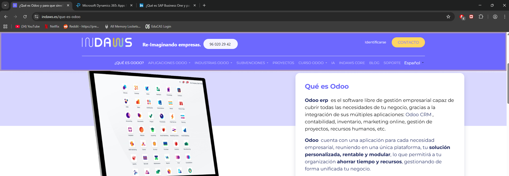
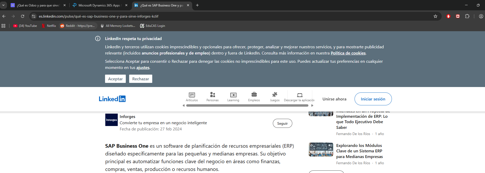

# Índice
- Análisis de los ERPs elegidos
- Casos en los que elegirías esos ERPs 
- Tabla Comparativa ERPs
- Conclusiones para el caso concreto (Elección de ERP y por qué)
- Fuentes y evidencias Requisitos de documentación oficial/artículos técnicos y capturas con URL visible

## 1.  Análisis de los ERPs elegidos

Odoo: Es un software libre de gestión empresarial capaz de cubrir las necesidades de tu negocio por la integración de varias aplicaciones

Microsoft Dynamics: Es un software que unifica datos y aplicaciones de negocio en una misma plataforma

SAP Business One: Es un software que sirve para pequeñas empresas el cual automatiza funciones de empresa de finanzas

## 2. Casos en los que elegir esos ERPs

Odoo: Cuando se valora la flexibilidad y se necesita una alta personalización

Microsoft Dynamics: Cuando se busca una solución escalable con una buena integración en el ecosistema 

SAP Business One: Cuando se necesitan hacer operaciones complejas de inventario o que se necesite una base financiera fiable
## 3. Tabla comparativa ERPs

| Criterio                    | Odoo                                             | Microsoft Dynamics                                | SAP Business One                     |
| --------------------------- | ------------------------------------------------ | ------------------------------------------------- | ------------------------------------ |
| Despliegue (nube/local)     | Nube y Local                                     | Nube                                              | Nube y Local                         |
| Facilidad de uso            | tiene una interfaz intuitiva y un diseño modular | Es una interfaz intuitiva y tiene vídeos de apoyo | Curva de aprendizaje alta            |
| Personalización/Integración | Muy alto (codigo abierto)                        | Alto                                              | Medio-Alto (dependiente de partners) |
| Seguridad/RGPD              | Dependiendo del despliegue                       | Muy alto                                          | Alto                                 |
| Cobertura por procesos      | Fuerte en servicios                              | Fuerte en finanzas                                | Fuerte en finanzas                   |
| Ecosistema/Soporte          | Comunidad activa                                 | Soporte de microsoft                              | soporte via partners                 |
| Coste total estimado        | Medio-Bajo                                       | Medio-Alto                                        | Alto                                 |
| Escalabilidad               | Alta                                             | Muy alta                                          | Alta                                 |
## 4. Conclusiones

El ERP utilizado seria Odoo

Elegiria Odoo para GreenGym ya que tiene un enfoque en Servicios  que lo hacen mas flexible para solucionar casos de gestion no solo eso si no que el coste es muy bajo lo que lo hace aun mejor
## 5. Fuentes 

